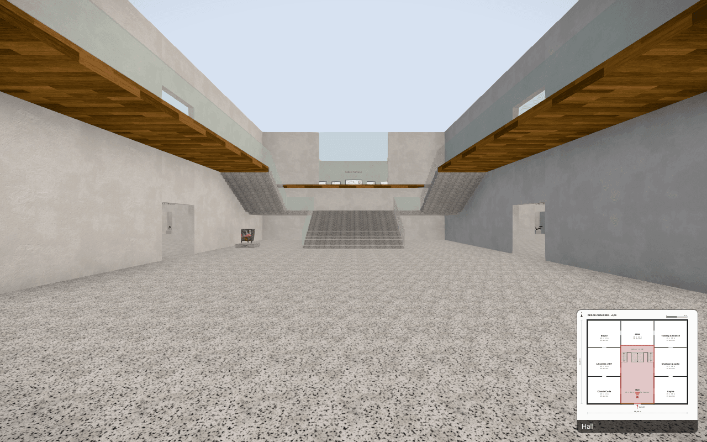
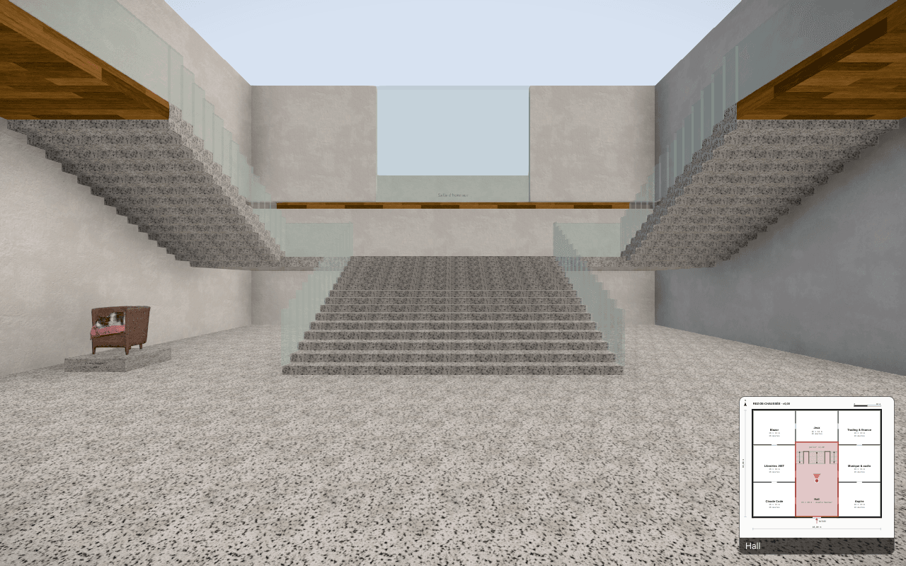
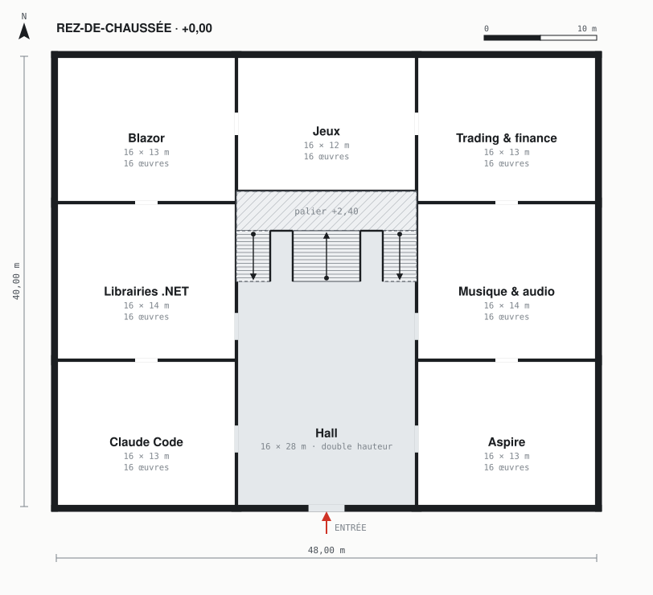
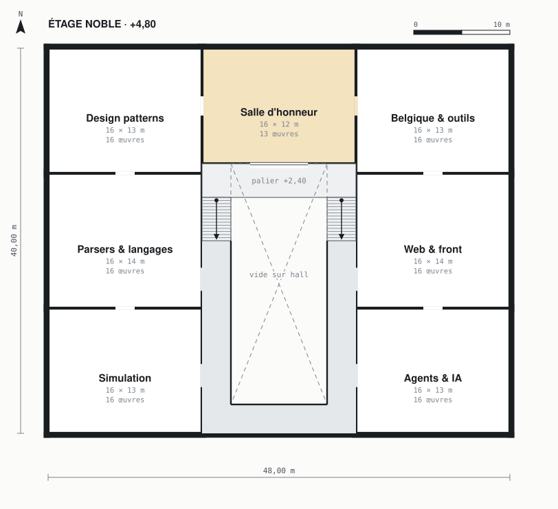
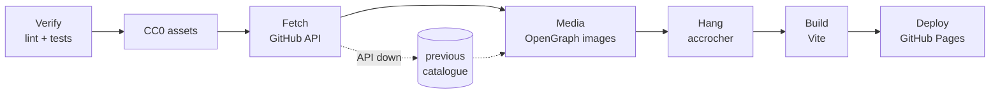

# Museum

A 3D museum you walk through in first person, where every GitHub repository is a painting on the wall.

**[Visit the museum → phmatray.github.io/museum](https://phmatray.github.io/museum/)**

<!-- portfolio-badges:start -->
<!-- Identity -->
[](https://github.com/phmatray/museum)

[](https://github.com/phmatray/museum/stargazers)
[](https://github.com/phmatray/museum/network/members)

<!-- Activity -->
[](https://github.com/phmatray/museum/issues)
[](https://github.com/phmatray/museum/pulls)
[](https://github.com/phmatray/museum/commits)
<!-- portfolio-badges:end -->



<!-- portfolio-toc:start -->

## Table of Contents

- [The building](#the-building)
- [The collection](#the-collection)
- [Controls](#controls)
- [How it is built and published](#how-it-is-built-and-published)
- [Run it locally](#run-it-locally)
- [Make it your own museum](#make-it-your-own-museum)
- [Tech Stack](#tech-stack)
- [Credits](#credits)

<!-- portfolio-toc:end -->

## The building

The museum is not generated: it is a fixed architect's plan, written by hand in [`src/plan/musee.ts`](src/plan/musee.ts). Two levels wrap around a **double-height entrance hall** (16 × 28 m). At the back of the hall an **imperial staircase** climbs a central flight to a landing, then splits into two side flights that reach the balconies of the upper floor, the *piano nobile*. Around the hall, **13 galleries**, and on the upper floor, facing the hall through a wide bay, the **Hall of Honour**.



The plan is checked by architect's rules in [`src/plan/rules.ts`](src/plan/rules.ts) (every room reachable, doors wide enough, headroom under the landing, comfortable stairs by Blondel's formula, enough wall to hang the collection), and drawn as plan sheets by `npm run plan:svg`:

| Ground floor | Upper floor |
|---|---|
| [](docs/plan/niveau-0.svg) | [](docs/plan/niveau-1.svg) |

## The collection

- **Each repository becomes a canvas**: its OpenGraph image, framed and hung on a wall, with a label giving its name, owner, language, stars and year.
- **One theme per room.** Repositories are grouped by clustering on their topics, name, description and language, down to exactly as many groups as there are galleries, so no room is ever empty. Each room takes the name of its theme.
- **The most-starred repositories** go to the Hall of Honour.
- **Every night**, a GitHub Actions workflow rebuilds the catalogue and the hanging, then republishes the site. The building never changes; only the room themes and the paintings on their walls follow the catalogue.

The hanging is deterministic: the same catalogue always gives the same museum, byte for byte.

## Controls

| Action | Desktop | Mobile |
|---|---|---|
| Enter the museum | Click the welcome screen (locks the pointer) | Tap the welcome screen |
| Move | `W` `A` `S` `D` or the arrow keys | Drag on the left half of the screen (joystick) |
| Look around | Mouse | Drag on the right half of the screen |
| Run | Hold `Shift` (6 m/s instead of 3.5 m/s) | — |
| Pause | `Esc` (releases the pointer, back to the welcome screen) | — |
| Guided tour | **Start Guided Tour** on the welcome screen; `Esc` or **Exit Tour (ESC)** to leave | Same button |

Movement keys are read by their **physical position** (`KeyW`, `KeyA`…), so on an AZERTY keyboard they are `Z` `Q` `S` `D` with no setting to change.

The **guided tour** walks you at a slower 1.8 m/s through every room, ground floor first then up the staircase to the Hall of Honour, pausing a few seconds in each; a caption shows the room's theme and your progress. The **minimap**, bottom right, is the architect's plan of the floor you are on, with your room highlighted and your field of view drawn on it.

## How it is built and published

[`.github/workflows/deploy.yml`](.github/workflows/deploy.yml) runs on every push to `main`, every night at 03:17 UTC, and on demand:



1. **Verify**: `npm run lint` and `npx vitest run`, against the versioned catalogue and hanging.
2. **CC0 assets**: restore the cache, then `node tools/fetch-assets.ts` downloads the PBR materials, the HDRI and the vegetation.
3. **Fetch**: `npm run fetch` pulls the repositories from the GitHub API into `public/data/catalogue.json`. If GitHub is down, the step degrades with a warning and the previous night's catalogue is republished.
4. **Media**: `npm run media` downloads the OpenGraph images and builds the painting textures and atlases (cached between builds; only what changed is re-downloaded).
5. **Hang**: `npm run accrocher` assigns themes to rooms and paintings to walls, writing `public/data/accrochage.json`.
6. **Build**: `npm run build` with `BASE_PATH=/museum/`.
7. **Deploy** to GitHub Pages.

## Run it locally

Requires **Node 22.18 or later** (the tools under `tools/` are TypeScript run directly by Node) and, for the catalogue, the [GitHub CLI](https://cli.github.com/).

```bash
npm ci
node tools/fetch-assets.ts                          # CC0 materials, HDRI, vegetation (~35 MB, idempotent)
GITHUB_TOKEN=$(gh auth token) npm run fetch         # repositories → public/data/catalogue.json
npm run media                                       # OpenGraph images → public/media/
npm run accrocher                                   # hang the collection → public/data/accrochage.json
npm run dev                                         # http://localhost:5173
```

The catalogue and the hanging are committed, so `npm ci`, the CC0 assets and `npm run media` are enough to get a museum on screen; `fetch` and `accrocher` refresh it.

Other commands:

```bash
npm test               # Vitest suite (does not typecheck: run `npx tsc -b` too)
npm run lint           # ESLint
npm run build          # typecheck + production build into dist/
npm run plan:svg       # redraw docs/plan/*.svg after editing src/plan/musee.ts
```

## Make it your own museum

- [`museum.config.json`](museum.config.json): `owners` lists the GitHub users and organisations whose repositories are exhibited; `filters` sets `excludeForks`, `excludeArchived`, `minStars`, `requireTopics` and `excludePatterns`.
- `curation.json` (optional, at the repository root, written by hand): `excluded` takes repositories out of the museum by key (`owner/name`); `repos` and `rooms` override individual entries.

Then run `fetch`, `media` and `accrocher` again. The building stays the same.

<!-- portfolio-techstack:start -->

## Tech Stack

- **React 19** (`react` ^19.2.4)
- **React Three Fiber** (`@react-three/fiber` ^9.5.0), `@react-three/drei` ^10.7.7, `@react-three/postprocessing` ^3.1.2
- **three.js** ^0.183.2
- **zustand** ^5.0.12 (state)
- **zod** ^4.4.3 (schemas for the catalogue, the hanging and the config files)
- **Vite** ^8.0.4 and **TypeScript** ~6.0.2
- **Vitest** ^4.1.4
- **sharp** ^0.35.3 (media pipeline)

<!-- portfolio-techstack:end -->

## Credits

- Materials, HDRI and vegetation are **CC0** (public domain), from ambientCG and Poly Haven: see [`public/assets/CREDITS.md`](public/assets/CREDITS.md).
- Labels and room names use **PT Sans**, under the SIL Open Font License: see [`public/assets/fonts/OFL.txt`](public/assets/fonts/OFL.txt).
- The sculptures in `public/assets/sculptures/` are the author's own works, all rights reserved: see [`SOURCES.md`](public/assets/sculptures/SOURCES.md).
