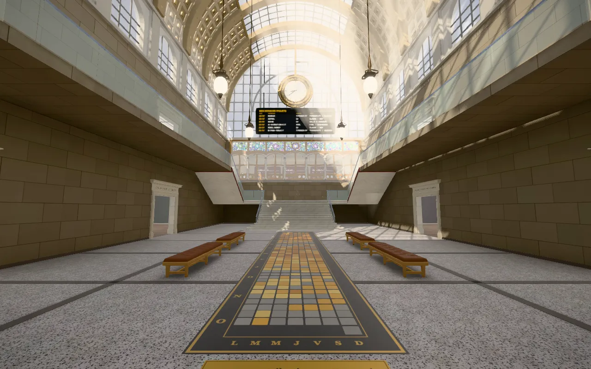
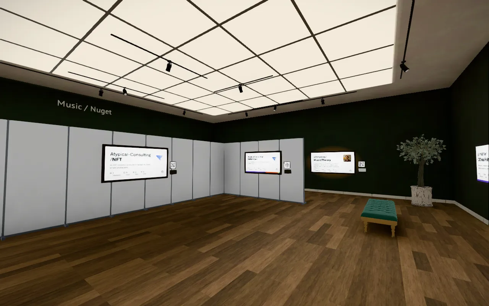
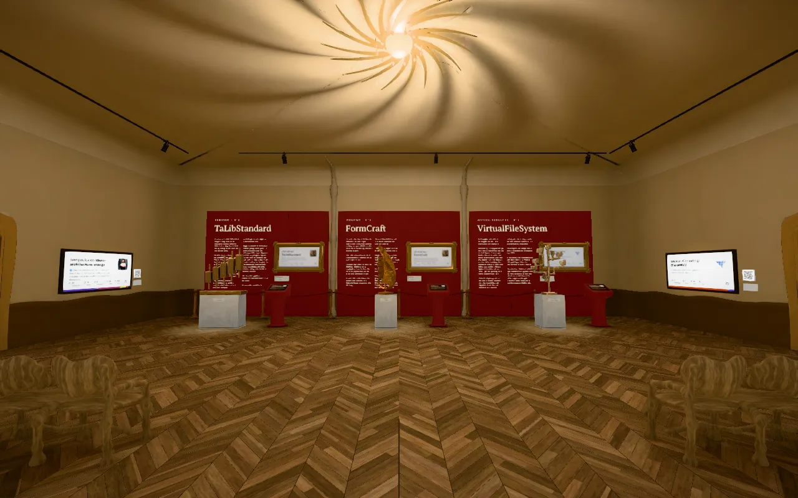
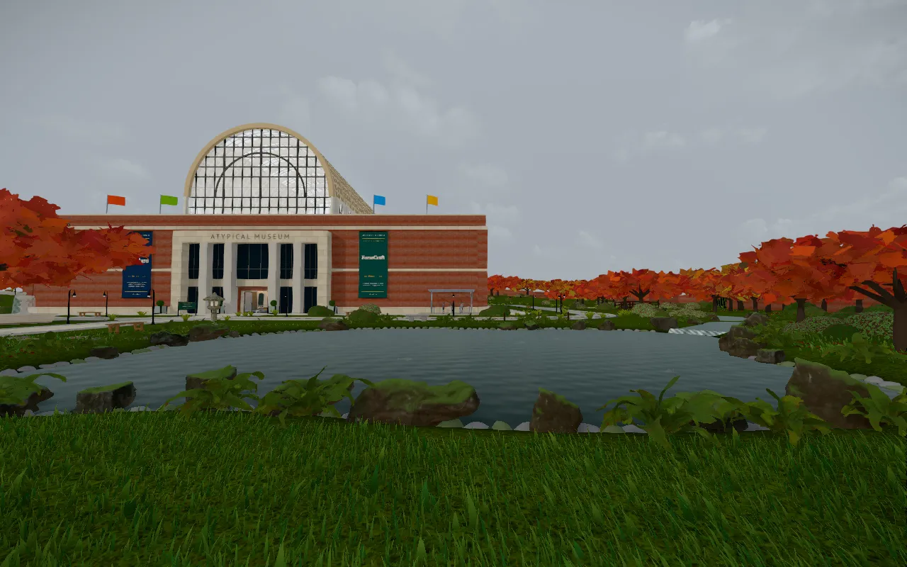
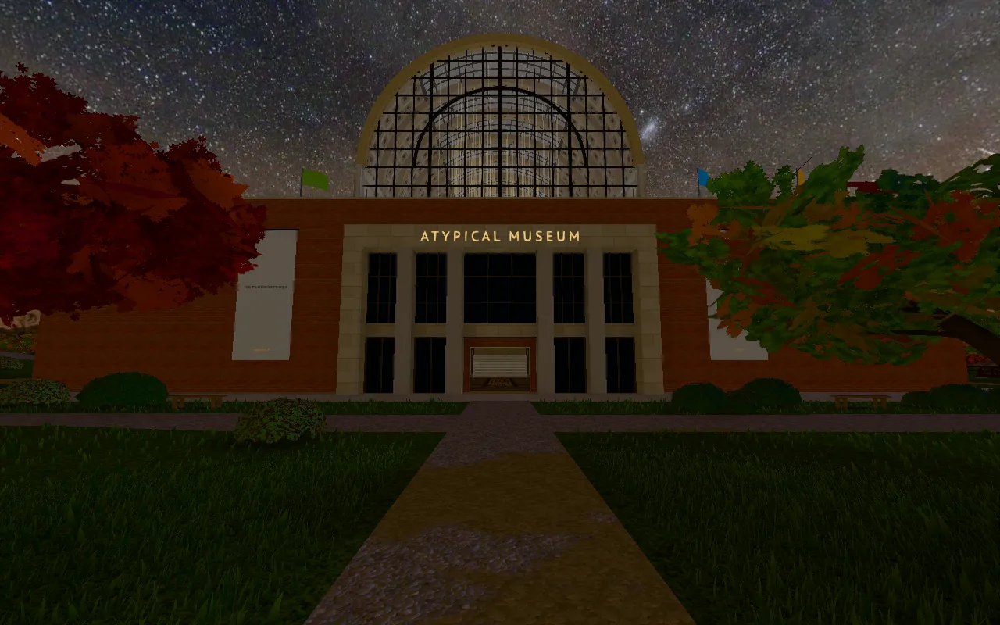
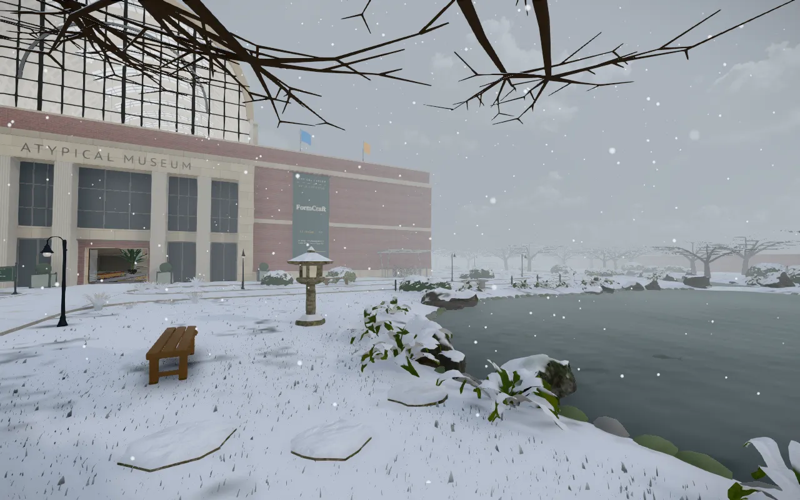
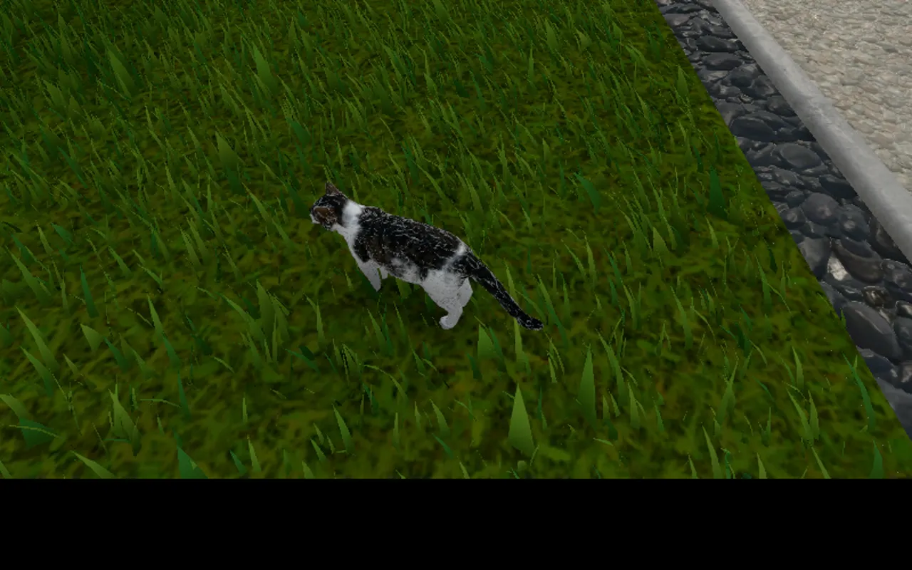
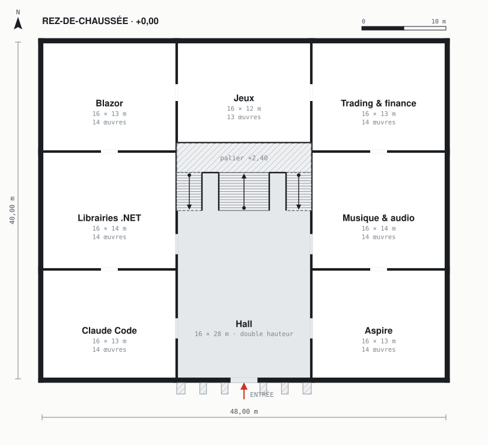
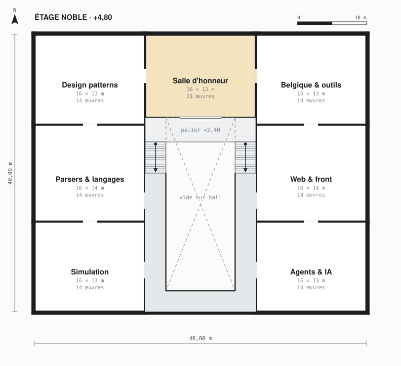
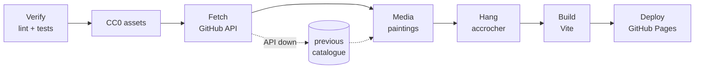

# Atypical Museum

A 3D museum you walk through in your browser, inspired by the Musée d'Orsay, where every GitHub repository is a painting on the wall.

**[Visit the museum → phmatray.github.io/museum](https://phmatray.github.io/museum/)**

<!-- portfolio-badges:start -->
<!-- Identity -->
[](https://github.com/phmatray/museum)

[](https://github.com/phmatray/museum/stargazers)
[](https://github.com/phmatray/museum/network/members)

<!-- Activity -->
[](https://github.com/phmatray/museum/issues)
[](https://github.com/phmatray/museum/pulls)
[](https://github.com/phmatray/museum/commits)
<!-- portfolio-badges:end -->

[](https://phmatray.github.io/museum/)

<!-- portfolio-toc:start -->

## Table of Contents

- [A tour of the museum](#a-tour-of-the-museum)
- [The collection](#the-collection)
- [Controls](#controls)
- [URL parameters](#url-parameters)
- [How it is built](#how-it-is-built)
- [Run it locally](#run-it-locally)
- [Make it your own museum](#make-it-your-own-museum)
- [Tech Stack](#tech-stack)
- [Credits](#credits)
- [License](#license)

<!-- portfolio-toc:end -->

## A tour of the museum

**The nave.** You enter a former railway station: a barrel vault of glass, a great gilded clock and, under it, a split-flap board, « Mes derniers projets », listing the latest repositories to be pushed. The clock rings the hours, and a bell announces every release published this week. An imperial marble staircase climbs to the balconies, and along the central aisle a **mosaic of the year's contributions** is inlaid in the floor, gold for busy days, grey stone for quiet ones. A brass visitor counter turns by the door, and a soundscape, synthesised in the browser, follows you from room to room (`M` to mute).

| | |
|---|---|
|  |  |
| **The galleries.** Twelve rooms on two floors, one colour and one theme each. Every painting has its label and its spotlight, and the busiest rooms get free-standing Novo modular panels for more wall. | **The Hall of Honour.** Upstairs, behind a Casa Batlló bay, the most-starred projects stand in Cernuschi-style showcases, each with a kiosk that shows the README. |
|  |  |
| **The garden.** A Japanese garden wraps the building: a pond with koi, a stream, stone lanterns, maples, birds by day and fireflies on summer nights. | **Real time, real sky.** The sun and the moon stand where they really are above Brussels, the shadows and light shafts follow them, and the sign on the façade lights up at night. |
|  |  |
| **Real weather and seasons.** The weather is Brussels' own (Open-Meteo): rain, snow, fog or storm, and the maples turn with the seasons. | **Bavette.** Philippe's cat, who is no longer with us, roams the museum and the garden freely. Look at him closely and his label appears. |

## The collection

- **Each repository becomes a painting**: a capture of its site or README, or its OpenGraph card, framed and hung, with a label giving its name, owner, language, stars and year. Look at a painting and a card opens: `Enter` visits the project's site, `E` opens the repository on GitHub, where the ★ Star button is one click away.
- **One theme per room.** Repositories are clustered on their topics, name, description and language, into exactly as many groups as there are galleries, so no room is ever empty.
- **The most-starred repositories** go to the Hall of Honour.
- **Every night**, a GitHub Actions workflow rebuilds the catalogue and the hanging, then republishes the site. The building never changes; only the room themes and the paintings do. The hanging is deterministic: the same catalogue always gives the same museum, byte for byte.

## Controls

| Action | Desktop | Mobile |
|---|---|---|
| Enter the museum | Click the welcome screen (locks the pointer) | Tap the welcome screen |
| Move | `W` `A` `S` `D` or the arrow keys | Drag on the left half of the screen (joystick) |
| Look around | Mouse | Drag on the right half of the screen |
| Run | Hold `Shift` | — |
| Visit a project's site / open it on GitHub | `Enter` (or `V`) / `E` while looking at a painting | — |
| Scroll a kiosk's README | `Page Up` / `Page Down` | — |
| Sound on / off | `M` or the speaker button | The speaker button |
| Pause | `Esc` (releases the pointer, back to the welcome screen) | — |
| Guided tour | **Start Guided Tour** on the welcome screen; `Esc` to leave | Same button |

Movement keys are read by their **physical position**, so on an AZERTY keyboard they are `Z` `Q` `S` `D` with nothing to configure. The **guided tour** walks through every room, ground floor first then up the staircase, pausing in each. The **minimap**, bottom right, is the architect's plan of your floor, with your room highlighted and your field of view drawn on it.

## URL parameters

For demos and screenshots, the address can force what is normally live:

| Parameter | Values | Effect |
|---|---|---|
| `?heure=HH:MM` | e.g. `?heure=21:30` | Sets the time of day (sun, moon, lights, clock) |
| `?meteo=` | `clair`, `pluie`, `neige`, `brouillard`, `orage` | Forces the weather instead of the live Brussels reading |
| `?saison=` | `printemps`, `ete`, `automne`, `hiver` | Forces the season (foliage, snow cover, fireflies) |
| `?ombres=0` | `0` | Turns off sun shadows (to measure their cost) |
| `?annonce=1` | `1` | Fakes a release on the last pushed repository, to hear the bell and see the board announce it |

They combine: [`?heure=19:50&meteo=neige&saison=hiver`](https://phmatray.github.io/museum/?heure=19:50&meteo=neige&saison=hiver).

## How it is built

- **The plan is the single source of truth.** The building is not generated: it is an architect's plan written by hand in [`src/plan/musee.ts`](src/plan/musee.ts). Walls, floors, doors, stairs, collisions, the minimap, the furniture and the lighting atlas are all derived from it, and [`src/plan/rules.ts`](src/plan/rules.ts) checks it like an architect would (every room reachable, doors wide enough, headroom under the landing, comfortable stairs by Blondel's formula, enough wall for the collection). `npm run plan:svg` draws it:

  | Ground floor | Upper floor |
  |---|---|
  | [](docs/plan/niveau-0.svg) | [](docs/plan/niveau-1.svg) |

- **Deterministic Blender scripts.** The nave, the staircase, the Casa Batlló bay, the showcases, the furniture, the garden and Bavette's rig are modelled by Python scripts in [`tools/blender/`](tools/blender/), run headless. The same script always gives the same GLB, and the GLBs are committed because CI has no Blender. So is the baked sky light (`npm run bake`, Cycles, then compressed to WebP).
- **Pure logic, thin rendering.** Anything that can be computed without three.js (the sun, the weather, the seasons, the hanging, Bavette's walk, the tour) lives in `src/plan/` and `src/domain/`, with Vitest tests. The scene in `src/scene/` only draws it, with instancing and few draw calls so that it runs on a laptop.
- **Data fetch.** [`.github/workflows/deploy.yml`](.github/workflows/deploy.yml) runs on every push to `main`, every night at 03:17 UTC and on demand:


```mermaid
flowchart LR
  V[Verify<br/>lint + tests] --> A[CC0 assets] --> F[Fetch<br/>GitHub API] --> M[Media<br/>paintings] --> H[Hang<br/>accrocher] --> B[Build<br/>Vite] --> D[Deploy<br/>GitHub Pages]
  F -. API down .-> C[(previous<br/>catalogue)] -.-> M
```

1. **Verify**: `npm run lint` and `npx vitest run`.
2. **CC0 assets**: `node tools/fetch-assets.ts` downloads the PBR materials, the HDRI and the vegetation (cached).
3. **Fetch**: `npm run fetch` pulls the repositories from the GitHub API into `public/data/catalogue.json`. If GitHub is down, the previous catalogue is republished.
4. **Media**: `npm run media` builds the painting textures and atlases (cached; only what changed is re-downloaded).
5. **Hang**: `npm run accrocher` assigns themes to rooms and paintings to walls (`public/data/accrochage.json`).
6. **Build** with `BASE_PATH=/museum/`, then **deploy** to GitHub Pages.

The story of how it came together, step by step and with screenshots, is in the **development journal** (in French): [`docs/journal/index.html`](docs/journal/index.html). GitHub shows its source, so download it or open it from a local clone to read it.

## Run it locally

Requires **Node 22.18 or later** (the tools under `tools/` are TypeScript run directly by Node) and, for the catalogue, the [GitHub CLI](https://cli.github.com/).

```bash
npm ci
node tools/fetch-assets.ts                          # CC0 materials, HDRI, vegetation (idempotent)
npm run media                                       # paintings → public/media/
npm run dev                                         # http://localhost:5173
```

The catalogue and the hanging are committed, so those three steps are enough to get a museum on screen. Other commands:

```bash
GITHUB_TOKEN=$(gh auth token) npm run fetch   # refresh the catalogue from GitHub
npm run captures       # screenshot each project's site or README image (before `media`)
npm run accrocher      # re-hang the collection
npm test               # Vitest suite (does not typecheck: run `npx tsc -b` too)
npm run lint           # ESLint
npm run build          # typecheck + production build into dist/
npm run plan:svg       # redraw docs/plan/*.svg after editing src/plan/musee.ts
npm run bake           # re-bake the building's light with Blender (BLENDER=/path/to/blender)
```

## Make it your own museum

- [`museum.config.json`](museum.config.json): `name` is the sign on the façade, `owners` lists the GitHub users and organisations on show, `location` sets where the sun and the weather come from, and `filters` sets `excludeForks`, `excludeArchived`, `minStars`, `requireTopics` and `excludePatterns`.
- `curation.json` (optional, at the repository root, written by hand): `excluded` takes repositories out by key (`owner/name`); `repos` and `rooms` override individual entries.

Then run `fetch`, `media` and `accrocher` again. The building stays the same.

<!-- portfolio-techstack:start -->

## Tech Stack

- **React 19**, **React Three Fiber** 9, `@react-three/drei`, `@react-three/postprocessing`
- **three.js** 0.183 (KTX2 textures, Draco meshes)
- **zustand** (state) and **zod** (schemas for the catalogue, the hanging and the config)
- **Vite** 8 and **TypeScript** 6, **Vitest** 4
- **sharp** (media pipeline), **Blender** 5 headless (models and light baking)

<!-- portfolio-techstack:end -->

## Credits

- Materials, HDRI and vegetation are **CC0** (public domain), from ambientCG and Poly Haven: see [`public/assets/CREDITS.md`](public/assets/CREDITS.md).
- Labels and room names use **PT Sans** and **PT Serif**, under the SIL Open Font License: see [`public/assets/fonts/OFL.txt`](public/assets/fonts/OFL.txt).
- Bavette and the pieces in `public/assets/sculptures/` are the author's own works, all rights reserved: see [`SOURCES.md`](public/assets/sculptures/SOURCES.md).
- Live weather by [Open-Meteo](https://open-meteo.com/).

## License

No open-source licence has been chosen yet: the code is © Philippe Matray, all rights reserved. The third-party assets above keep their own licences.
