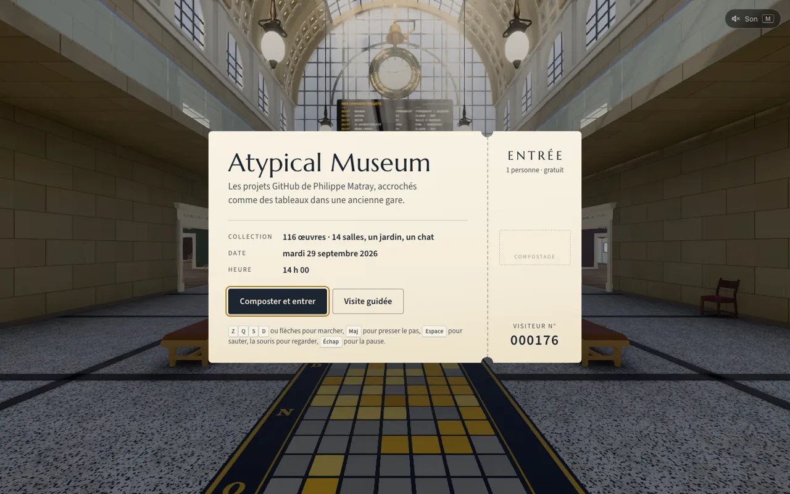
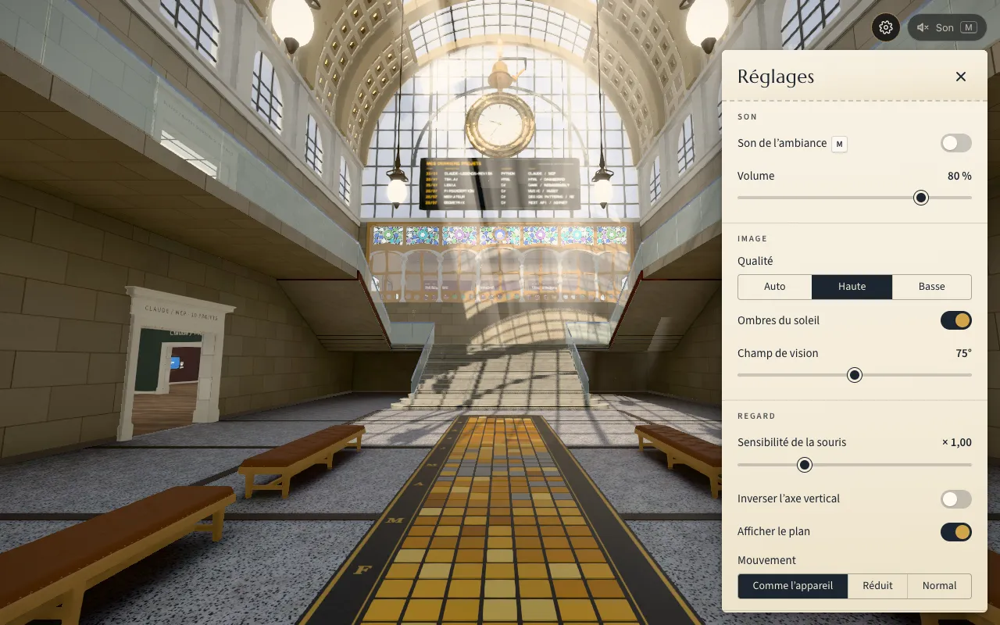
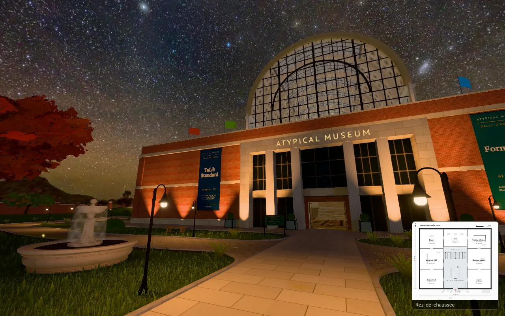
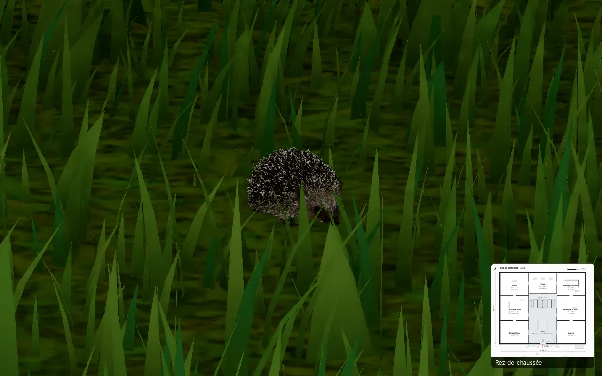
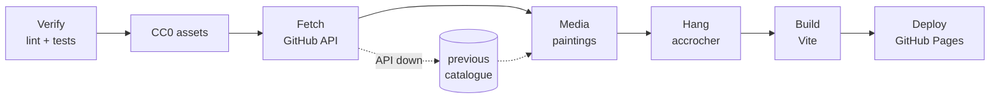

# Atypical Museum

A 3D museum you walk through in your browser, inspired by the Musée d'Orsay, where every GitHub repository is a painting on the wall.

**[Visit the museum → phmatray.github.io/museum](https://phmatray.github.io/museum/)**

<!-- portfolio-badges:start -->
<!-- Identity -->
[](https://github.com/phmatray/museum)

[](https://github.com/phmatray/museum/stargazers)
[](https://github.com/phmatray/museum/network/members)

<!-- Activity -->
[](https://github.com/phmatray/museum/issues)
[](https://github.com/phmatray/museum/pulls)
[](https://github.com/phmatray/museum/commits)
[](https://github.com/phmatray/museum/releases)
<!-- portfolio-badges:end -->

[](https://phmatray.github.io/museum/)

<!-- portfolio-toc:start -->

## Table of Contents

- [A tour of the museum](#a-tour-of-the-museum)
- [Welcome ticket and settings](#welcome-ticket-and-settings)
- [The collection](#the-collection)
- [Controls](#controls)
- [URL parameters](#url-parameters)
- [How it is built](#how-it-is-built)
- [Run it locally](#run-it-locally)
- [Make it your own museum](#make-it-your-own-museum)
- [Tech Stack](#tech-stack)
- [Releases](#releases)
- [Credits](#credits)
- [License](#license)

<!-- portfolio-toc:end -->

## A tour of the museum

**The nave.** You come in with a stamped ticket and enter a former railway station: a barrel vault of glass, a great gilded clock and, under it, a split-flap board, « Mes derniers projets », listing the latest repositories to be pushed. The clock rings the hours, and a bell announces every release published this week. An imperial marble staircase, framed by two kentia palms, climbs to the balconies, and along the central aisle a **mosaic of the year's contributions** is inlaid in the floor, gold for busy days, grey stone for quiet ones. A brass visitor counter turns by the door, and a soundscape, synthesised in the browser, follows you from room to room (`M` to mute).

| | |
|---|---|
|  |  |
| **The galleries.** Themed rooms on two floors, one colour, one theme and one species of tree each. Every painting has its label, its spotlight and a QR code that opens the repository on a phone; the busiest rooms get free-standing Novo panels, straight or L-shaped. | **The Hall of Honour.** Upstairs, behind a Casa Batlló bay, the flagship projects stand in Cernuschi-style showcases, each with a bronze sculpture and a kiosk that shows the README. Below it, the **workshop** shows the same projects in cross-section: their real architecture (.NET projects or npm workspaces) as layers of glass joined by glowing wires. |
|  |  |
| **The garden.** A Japanese garden wraps the building: a pond with koi, a stream, stone lanterns, maples, birds by day and fireflies on summer nights. A baby hedgehog trots across the lawn after dusk, and rolls into a ball if you come too close. | **Real time, real sky.** The sun and the moon stand where they really are above Brussels, the shadows and light shafts follow them. At night the façade is floodlit and 32 lamp posts light the paths. |
|  |  |
| **Real weather and seasons.** The weather is Brussels' own (Open-Meteo): rain, snow, fog or storm, seen and heard from inside as well, puddles that mirror the sky, and maples that turn with the seasons, down to bare twigs in winter. | **Bavette.** Philippe's cat, who is no longer with us, roams the museum and the garden freely, with the proportions and coat of the videos he was modelled from. Now and then he jumps onto a bench and naps there, curled up. Look at him closely and his label appears. |

## Welcome ticket and settings

| | |
|---|---|
|  |  |
| **A stamped ticket.** The Musée d'Orsay was a railway station, so you enter with a ticket printed from the live museum: works and rooms on show today, the date and time, your visitor number from the counter by the door, and your destination if you followed a shared link. **Stamp and enter** punches it, and it fades onto the nave. | **Settings** (`R` or the gear next to the sound button): volume, image quality (adaptive by default), shadows, field of view, mouse sensitivity and inverted Y, the minimap, reduced motion, and a chosen hour, weather or season. Kept on your device; a URL parameter always wins. |
|  |  |
| **Lit at night.** Lamp posts, floodlights and recessed spots under the balconies, computed in the materials rather than as real-time lights, so they cost nothing measurable. | **The hedgehog.** Mostly out at night, asleep in winter, modelled after a photo and a video from Philippe's garden. |

## The collection

- **Each repository becomes a painting**: a capture of its site or README, or its OpenGraph card, framed and hung, with a label giving its name, owner, language, stars and year, and a QR code. Look at a painting and a card opens with the same QR code, large enough to scan from a phone: `Enter` visits the project's site, `E` opens the repository on GitHub, where the ★ Star button is one click away, and `P` shares a link that opens the museum right in front of that painting.
- **One theme per room.** Repositories are clustered on their topics, name, description and language, into exactly as many groups as there are galleries, then balanced so that every gallery holds 7 to 13 paintings and no wall is left nearly bare.
- **The most-starred repositories** go to the Hall of Honour.
- **Every night**, a GitHub Actions workflow rebuilds the catalogue and the hanging, then republishes the site. The building never changes; only the room themes and the paintings do. The hanging is deterministic: the same catalogue always gives the same museum, byte for byte.

## Controls

| Action | Desktop | Mobile |
|---|---|---|
| Enter the museum | **Stamp and enter** on the ticket, or `Enter` (locks the pointer) | **Stamp and enter** |
| Move | `W` `A` `S` `D` or the arrow keys | Drag on the left half of the screen (joystick) |
| Look around | Mouse | Drag on the right half of the screen |
| Run | Hold `Shift` | — |
| Jump | `Space` | — |
| Settings | `R` or the gear button | The gear button |
| Visit a project's site / open it on GitHub / share it | `Enter` (or `V`) / `E` / `P` while looking at a painting | Buttons on the painting's card |
| Scroll a kiosk's README | `Page Up` / `Page Down` | — |
| Sound on / off | `M` or the speaker button | The speaker button |
| Pause | `Esc` (releases the pointer, back to the welcome screen) | — |
| Guided tour | **Guided tour** on the ticket; walk, click or `Esc` to take over | Same button; move the joystick to take over |
| Minimap | Click it to open the full plan (wheel to zoom) | Tap it, pinch to zoom |

Movement keys are read by their **physical position**, so on an AZERTY keyboard they are `Z` `Q` `S` `D` with nothing to configure. The **guided tour** walks through every room, ground floor first then up the staircase, pausing in each; press a movement key or move the joystick and you carry on on foot from where you are. The **minimap**, bottom right, is the architect's plan of your floor, with your room highlighted, your field of view and Bavette drawn on it; open it full screen to zoom in.

## URL parameters

For demos and screenshots, the address can force what is normally live:

| Parameter | Values | Effect |
|---|---|---|
| `?heure=HH:MM` | e.g. `?heure=21:30` | Sets the time of day (sun, moon, lights, clock) |
| `?meteo=` | `clair`, `pluie`, `neige`, `brouillard`, `orage` | Forces the weather instead of the live Brussels reading |
| `?saison=` | `printemps`, `ete`, `automne`, `hiver` | Forces the season (foliage, snow cover, fireflies) |
| `?ombres=0` | `0` | Turns off sun shadows (to measure their cost) |
| `?qualite=` | `haute`, `basse` | Freezes the image quality instead of adapting it to the machine |
| `?p=` | a repository name, e.g. `?p=FormCraft` | Opens the museum in front of that painting (also `?projet=owner/repo` or `#repo`) |
| `?annonce=1` | `1` | Fakes a release on the last pushed repository, to hear the bell and see the board announce it |

They combine: [`?heure=19:50&meteo=neige&saison=hiver`](https://phmatray.github.io/museum/?heure=19:50&meteo=neige&saison=hiver).

## How it is built

- **The plan is the single source of truth.** The building is not generated: it is an architect's plan written by hand in [`src/plan/musee.ts`](src/plan/musee.ts). Walls, floors, doors, stairs, collisions, the minimap, the furniture and the lighting atlas are all derived from it, and [`src/plan/rules.ts`](src/plan/rules.ts) checks it like an architect would (every room reachable, doors wide enough, headroom under the landing, comfortable stairs by Blondel's formula, enough wall for the collection). `npm run plan:svg` draws it:

  | Ground floor | Upper floor |
  |---|---|
  | [](docs/plan/niveau-0.svg) | [](docs/plan/niveau-1.svg) |

- **Deterministic Blender scripts.** The nave, the staircase, the Casa Batlló bay, the showcases, the furniture, the garden and Bavette's rig are modelled by Python scripts in [`tools/blender/`](tools/blender/), run headless. The same script always gives the same GLB, and the GLBs are committed because CI has no Blender. So is the baked sky light (`npm run bake`, Cycles, then compressed to WebP).
- **Pure logic, thin rendering.** Anything that can be computed without three.js (the sun, the weather, the seasons, the hanging, Bavette's walk and naps, the hedgehog, the tour, the ticket) lives in `src/plan/` and `src/domain/`, with Vitest tests. The scene in `src/scene/` only draws it.
- **Performance without cutting features.** Plan boxes are instanced; the sun's shadow map is only redrawn when something moves; grass and trees out of view are skipped and distant maples use a lighter model; labels are batched; model textures are KTX2; about 110 shader programs, compiled off the main thread during the loading screen; the pixel ratio only drops when the machine can't keep up. Night lighting, rain and puddles are computed per pixel in the materials, with no extra lights.
- **Data fetch.** [`.github/workflows/deploy.yml`](.github/workflows/deploy.yml) runs on every push to `main`, every night at 03:17 UTC and on demand:


```mermaid
flowchart LR
  V[Verify<br/>lint + tests] --> A[CC0 assets] --> F[Fetch<br/>GitHub API] --> M[Media<br/>paintings] --> H[Hang<br/>accrocher] --> B[Build<br/>Vite] --> D[Deploy<br/>GitHub Pages]
  F -. API down .-> C[(previous<br/>catalogue)] -.-> M
```

1. **Verify**: `npm run lint` and `npx vitest run`.
2. **CC0 assets**: `node tools/fetch-assets.ts` downloads the PBR materials, the HDRI and the vegetation (cached).
3. **Fetch**: `npm run fetch` pulls the repositories from the GitHub API into `public/data/catalogue.json`. If GitHub is down, the previous catalogue is republished.
4. **Media**: `npm run media` builds the painting textures and atlases (cached; only what changed is re-downloaded).
5. **Hang**: `npm run accrocher` assigns themes to rooms and paintings to walls (`public/data/accrochage.json`).
6. **Build** with `BASE_PATH=/museum/`, then **deploy** to GitHub Pages.

The story of how it came together, more than 90 steps with before/after screenshots, is in the **development journal** (in French): [`docs/journal/index.html`](docs/journal/index.html), with tabs by theme and an index. GitHub shows its source, so download it or open it from a local clone to read it.

## Run it locally

Requires **Node 22.18 or later** (the tools under `tools/` are TypeScript run directly by Node) and, for the catalogue, the [GitHub CLI](https://cli.github.com/).

```bash
npm ci
node tools/fetch-assets.ts                          # CC0 materials, HDRI, vegetation (idempotent)
npm run media                                       # paintings → public/media/
npm run dev                                         # http://localhost:5173
```

The catalogue and the hanging are committed, so those three steps are enough to get a museum on screen. Other commands:

```bash
GITHUB_TOKEN=$(gh auth token) npm run fetch   # refresh the catalogue from GitHub
npm run captures       # screenshot each project's site or README image (before `media`)
npm run accrocher      # re-hang the collection
npm test               # Vitest suite (does not typecheck: run `npx tsc -b` too)
npm run lint           # ESLint
npm run build          # typecheck + production build into dist/
npm run plan:svg       # redraw docs/plan/*.svg after editing src/plan/musee.ts
npm run bake           # re-bake the building's light with Blender (BLENDER=/path/to/blender)
npm run ateliers       # re-read the flagship repositories' architecture for the workshop
node tools/compresser-glb.ts <file.glb>   # re-encode a re-exported GLB's textures to KTX2
```

## Make it your own museum

- [`museum.config.json`](museum.config.json): `name` is the sign on the façade, `owners` lists the GitHub users and organisations on show, `location` sets where the sun and the weather come from, and `filters` sets `excludeForks`, `excludeArchived`, `minStars`, `requireTopics` and `excludePatterns`.
- `curation.json` (optional, at the repository root, written by hand): `excluded` takes repositories out by key (`owner/name`); `repos` and `rooms` override individual entries.

Then run `fetch`, `media` and `accrocher` again. The building stays the same.

<!-- portfolio-techstack:start -->

## Tech Stack

- **React 19**, **React Three Fiber** 9, `@react-three/drei`, `@react-three/postprocessing`
- **three.js** 0.183 (KTX2 textures, Draco meshes)
- **zustand** (state) and **zod** (schemas for the catalogue, the hanging and the config)
- **Vite** 8 and **TypeScript** 6, **Vitest** 4
- **troika-three-text** (labels, batched), **qrcode-generator**, **@fontsource** (Marcellus, Source Sans 3)
- **sharp** and **gltf-transform** (media and model pipeline), **Blender** 5 headless (models and light baking)

<!-- portfolio-techstack:end -->

## Releases

Each batch of finished work ships as a [GitHub release](https://github.com/phmatray/museum/releases) with notes in French, once the Pages deployment has succeeded. The site itself is rebuilt on every push to `main` and every night.

## Credits

- Materials, HDRI and vegetation are **CC0** (public domain), from ambientCG and Poly Haven: see [`public/assets/CREDITS.md`](public/assets/CREDITS.md).
- Labels and room names use **PT Sans** and **PT Serif**; the ticket and the settings use **Marcellus** and **Source Sans 3**; all under the SIL Open Font License: see [`public/assets/fonts/OFL.txt`](public/assets/fonts/OFL.txt).
- Some models (sculptures, furniture, planters, bikes, the hedgehog) were generated with **Meshy** from concept images, and are listed with their prompts in [`public/assets/CREDITS.md`](public/assets/CREDITS.md).
- Bavette and the pieces in `public/assets/sculptures/` are the author's own works, all rights reserved: see [`SOURCES.md`](public/assets/sculptures/SOURCES.md).
- Live weather by [Open-Meteo](https://open-meteo.com/).

## License

The code is released under the [MIT License](LICENSE) © 2026 Philippe Matray. The third-party assets listed above keep their own licences.
