# Planche de relecture

Captures du musée, régénérées par :

```bash
npm run dev
node tools/capture.ts --url http://localhost:5173/
node tools/screenshots.ts
```

Elles sont ici pour qu'un chantier de RENDU se relise sans avoir à le rejouer : on ne juge pas un éclairage sur un tableau de chiffres, et refaire ces images demande Chrome, le serveur Vite et 345 Mo de sources de végétation.

Redimensionnées à 1440 px et encodées en WebP q80 — 1.30 Mo au total, contre 56 Mo de PNG bruts. Les originaux en 2880×1800 restent dans `.captures/`, qui n'est pas versionné.

## Budget §9, sur la vue la plus chère

| Poste | Relevé | Plafond | |
|---|--:|--:|---|
| calls | 260 | 150 | ✗ |
| triangles | 954 667 | 1 000 000 | ✓ |
| lights | 12 | 12 | ✓ |
| shadowCasters | 1 | 2 | ✓ |

Le plafond de draw calls est dépassé, et il l'était avant ce chantier — le compteur est laissé rouge parce qu'il dit quelque chose de vrai. Le levier qui le fermerait est connu et non tiré : fusionner les murs d'un plateau par matière (71 murs, un appel chacun).

## Les plans cotés

Un par niveau, produits par `node tools/plan.ts`. Ils portent le mobilier, le décor et **les recouvrements**, cerclés de rouge.

Trait plein : ce qui est au sol, dans lequel on se cogne. Trait pointillé : ce qui est au-dessus de la tête et qu'on regarde par en dessous — c'est un plan de plafond réfléchi, et c'est la seule façon de voir un débord, qui par définition ne touche pas le sol.

### `plan-etage-1`

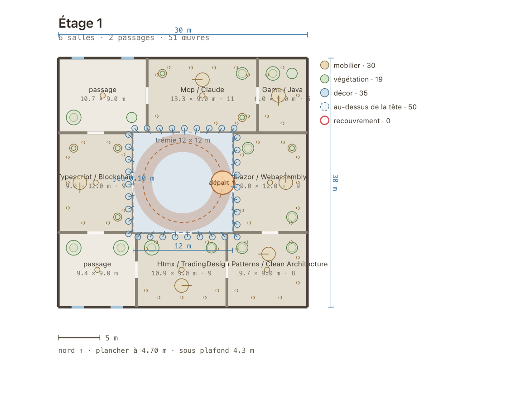

### `plan-etage-2`

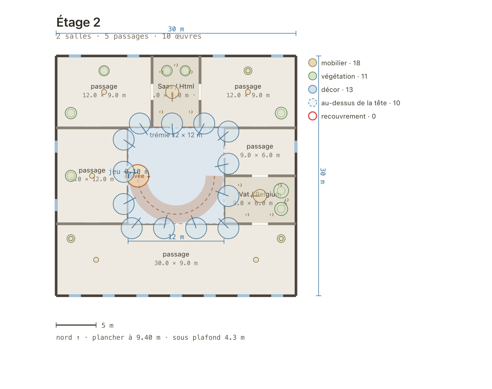

### `plan-rdc`

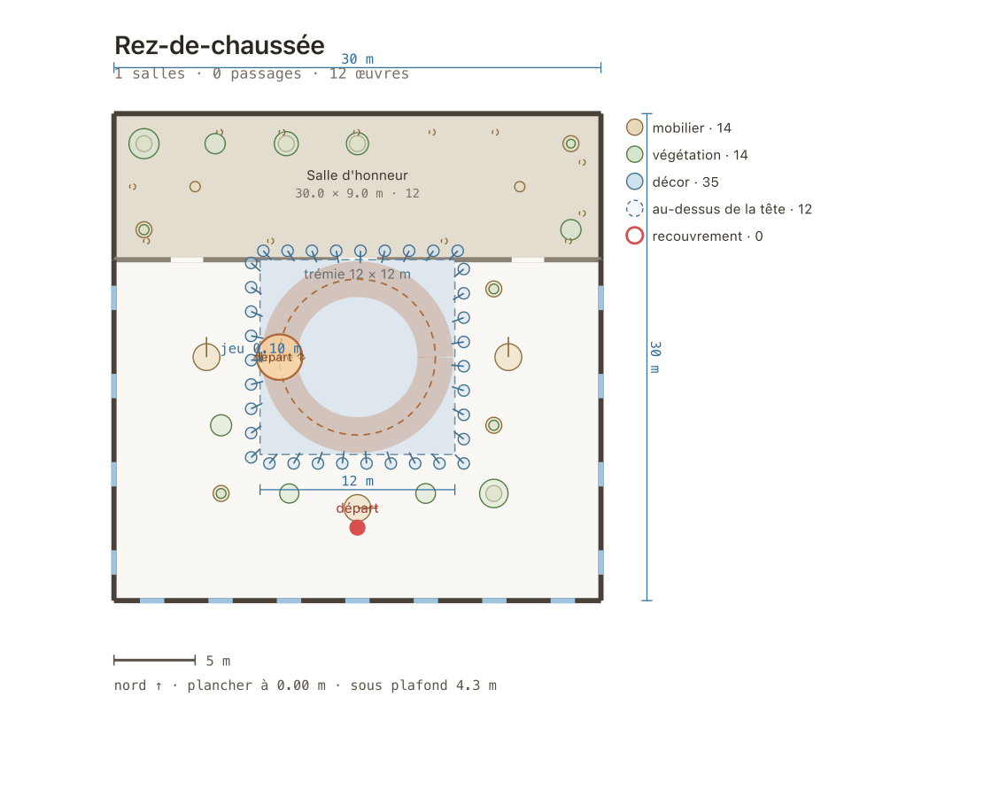

### `plan-reserve`

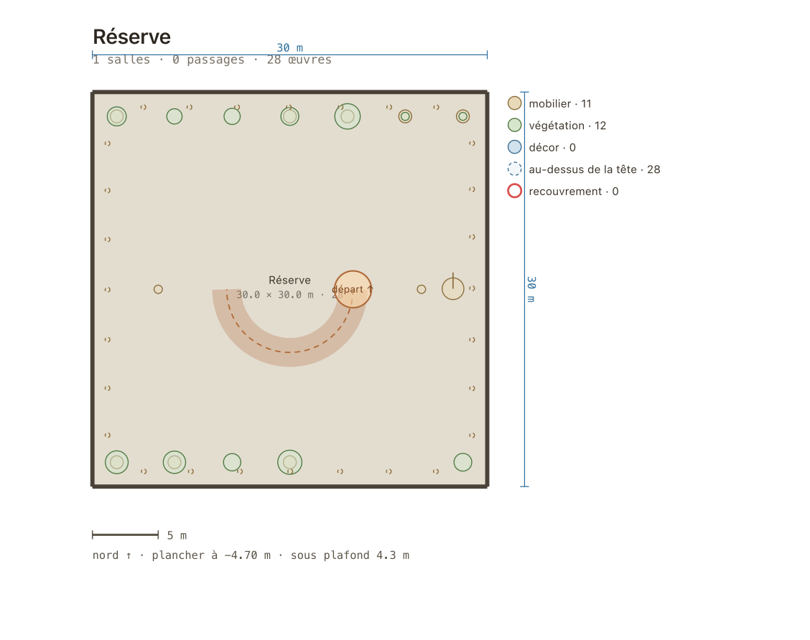
## Les vues

### `entree`

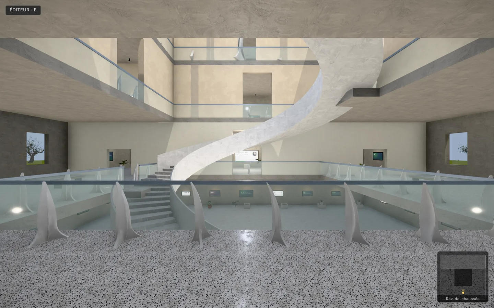

**Ce qu'elle prouve** — vue d'accueil : plus de masse noire, et le plafond n'est plus du parquet

| draw calls | triangles | noir < 25 | blanc > 250 | luminance | σ |
|--:|--:|--:|--:|--:|--:|
| 260 | 954 667 | 0.07 % | 0.01 % | 137.9 | 34.4 |

### `exterieur`

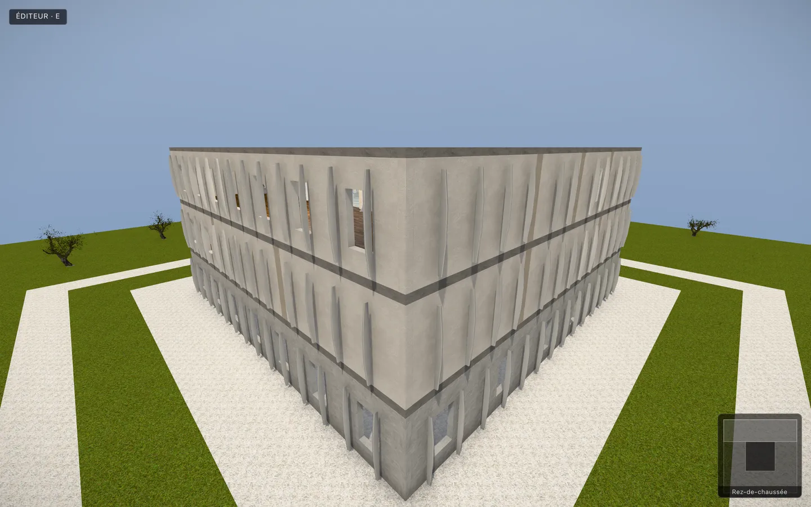

**Ce qu'elle prouve** — silhouette et façade : teinte unique, pas de bandeau de bois par niveau

| draw calls | triangles | noir < 25 | blanc > 250 | luminance | σ |
|--:|--:|--:|--:|--:|--:|
| 257 | 954 287 | 0.01 % | 0 % | 147.1 | 49.8 |

### `atrium-plongee`

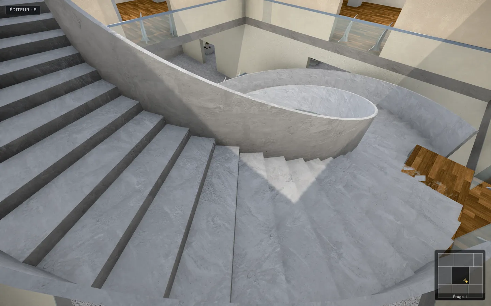

**Ce qu'elle prouve** — la rampe vue de haut : garde-corps et sous-face du tablier

| draw calls | triangles | noir < 25 | blanc > 250 | luminance | σ |
|--:|--:|--:|--:|--:|--:|
| 226 | 951 837 | 0 % | 0 % | 133 | 33.2 |

### `ligne-de-vue`

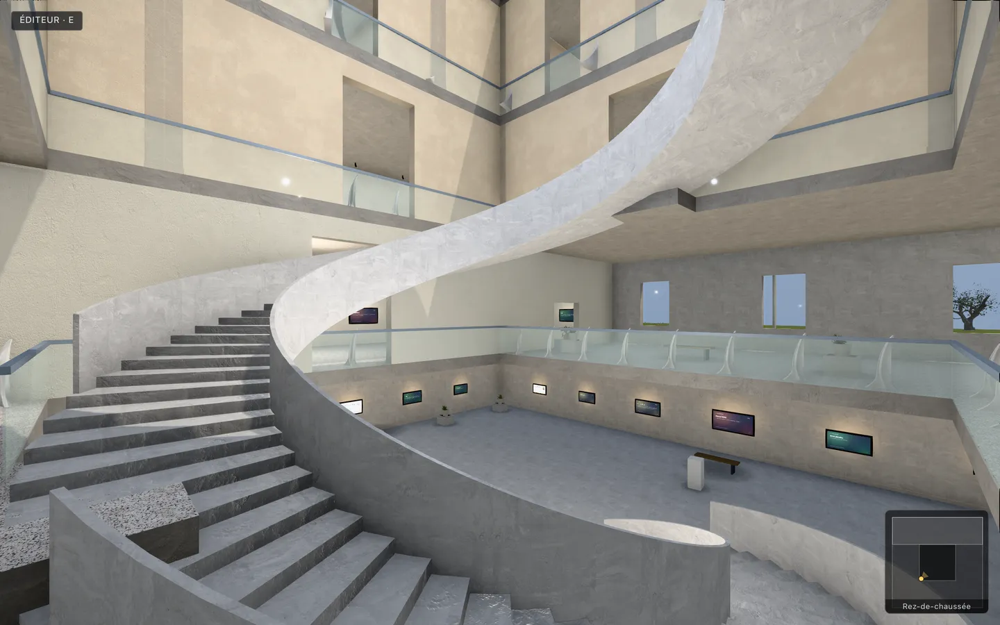

**Ce qu'elle prouve** — traversée de l’atrium à hauteur d’œil : le vide doit rester un vide

| draw calls | triangles | noir < 25 | blanc > 250 | luminance | σ |
|--:|--:|--:|--:|--:|--:|
| 251 | 954 071 | 0.1 % | 0 % | 140 | 45 |

### `atrium-nervures`

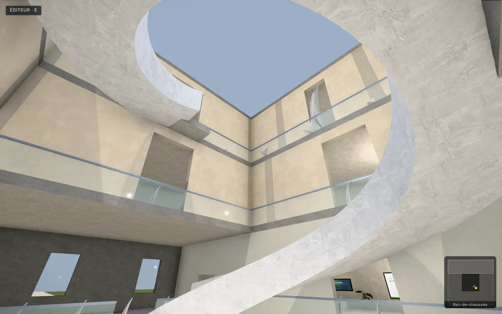

**Ce qu'elle prouve** — les nervures d’atrium : de la structure sur trois niveaux, pas un bandeau flottant

| draw calls | triangles | noir < 25 | blanc > 250 | luminance | σ |
|--:|--:|--:|--:|--:|--:|
| 244 | 953 519 | 0.04 % | 0 % | 168.2 | 38.2 |

### `coin`

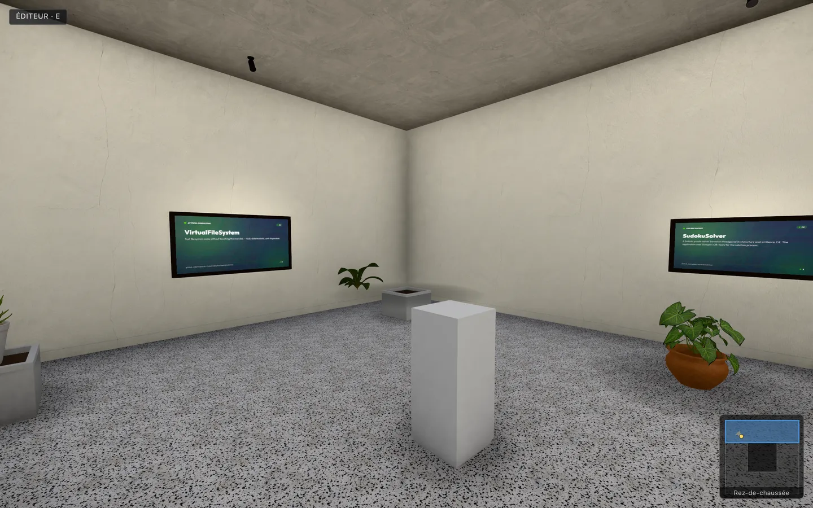

**Ce qu'elle prouve** — l'angle de salle : le SSAO doit y creuser un dégradé

| draw calls | triangles | noir < 25 | blanc > 250 | luminance | σ |
|--:|--:|--:|--:|--:|--:|
| 158 | 809 207 | 0.89 % | 0 % | 114.4 | 26.9 |

### `coin-sans-postfx`

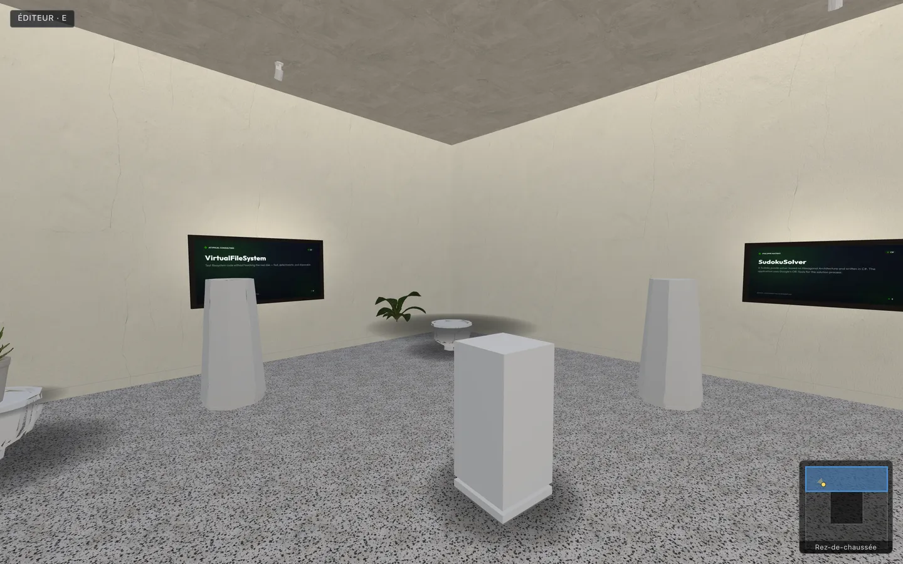

**Ce qu'elle prouve** — même caméra, sans post-traitement : le témoin du A/B

| draw calls | triangles | noir < 25 | blanc > 250 | luminance | σ |
|--:|--:|--:|--:|--:|--:|
| 103 | 808 766 | 2.95 % | 0.01 % | 124.8 | 26.9 |

### `escalier`

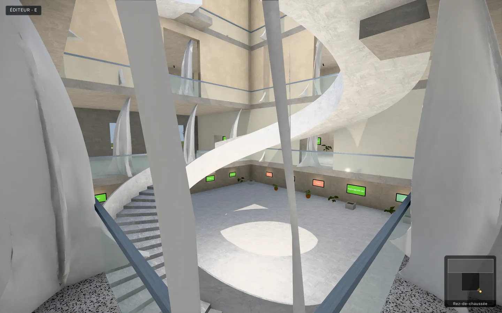

**Ce qu'elle prouve** — l'escalier hélicoïdal : girons et contremarches, pas un plan incliné

| draw calls | triangles | noir < 25 | blanc > 250 | luminance | σ |
|--:|--:|--:|--:|--:|--:|
| 247 | 953 543 | 0.1 % | 0 % | 144 | 41 |

### `fenetre`

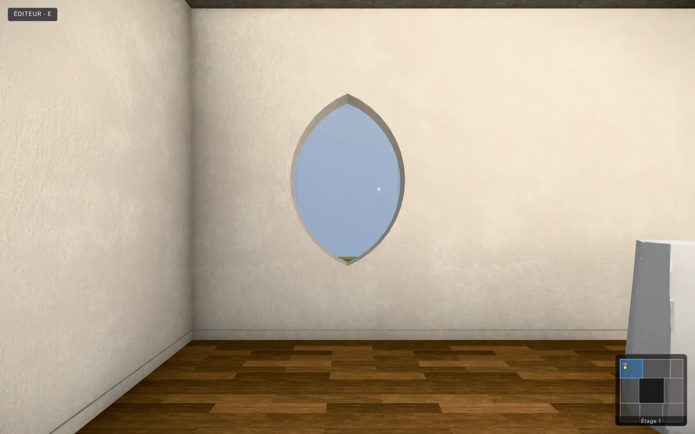

**Ce qu'elle prouve** — depuis un passage : la vue sur le parc, et la vitre qui la porte

| draw calls | triangles | noir < 25 | blanc > 250 | luminance | σ |
|--:|--:|--:|--:|--:|--:|
| 135 | 804 419 | 0.03 % | 0 % | 118.5 | 39.2 |

### `palier`

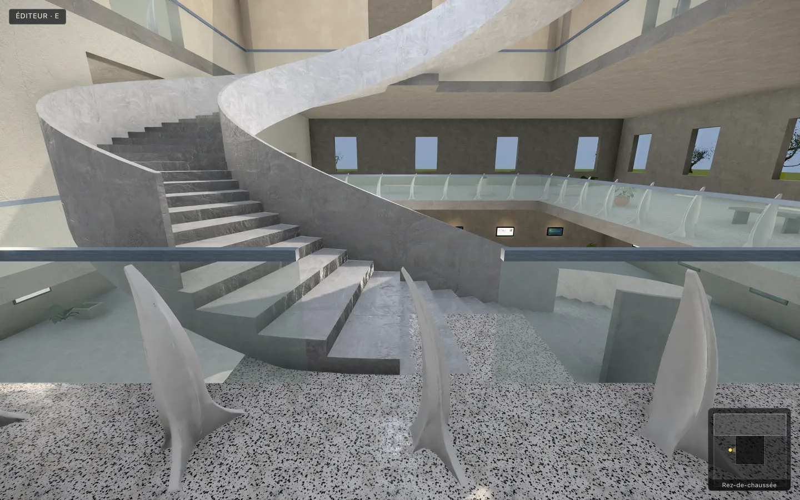

**Ce qu'elle prouve** — le palier : le garde-corps doit s'ouvrir devant la première marche

| draw calls | triangles | noir < 25 | blanc > 250 | luminance | σ |
|--:|--:|--:|--:|--:|--:|
| 237 | 952 715 | 0.21 % | 0 % | 130 | 37.2 |

### `plafond`

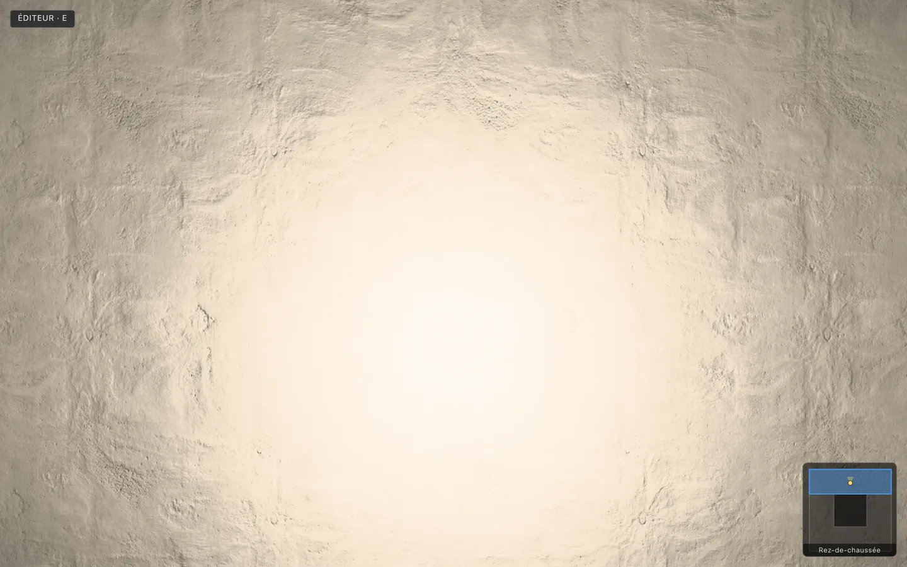

**Ce qu'elle prouve** — regard vers le haut : la sous-face de dalle doit être du béton clair

| draw calls | triangles | noir < 25 | blanc > 250 | luminance | σ |
|--:|--:|--:|--:|--:|--:|
| 188 | 947 363 | 0 % | 0.02 % | 199.3 | 36.2 |
